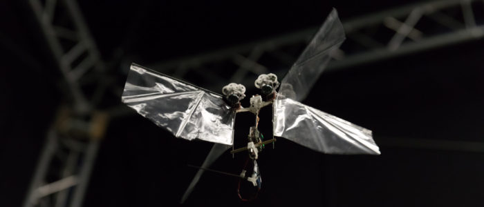

# 
 Biomimicry in Aeronautics: Studying Fly Wing Characteristics to Improve Aircraft Aerodynamics

## 
 Group 4 - Sodium   *Abian, Apale, Bragat, Emin, Gamale, Lozada*

### Topic Description:
  
  Flying is now possible as a result of technological advancements and in aeronautics, animal wing designs have long been applied to aircraft innovation. The ornithopter from the 1870s is an aircraft that flies by flapping its wings and is inspired by birds. Recently, micro-unmanned ornithopters have been critical in the surveillance of people and terrain. Locally, flapping-wing micro-air vehicles (FWMAVs) could aid in the surveillance of seismic areas, forest degradation due to climate change, and difficult terrain, such as mountains where Filipino trekkers have perished.  
  
  In a recent study by Zhang et al. (2023), the design and aerodynamics of FWMAVs were analyzed, including the currently-popular DelFly Nimble, inspired by fruit flies. This review showcased how mimicking fly wing characteristics in the innovation of ornithopters stems from biology, chemistry, and physics.

**Figure 1.** _DelFly Nimble (DelFly, n.d.)._
